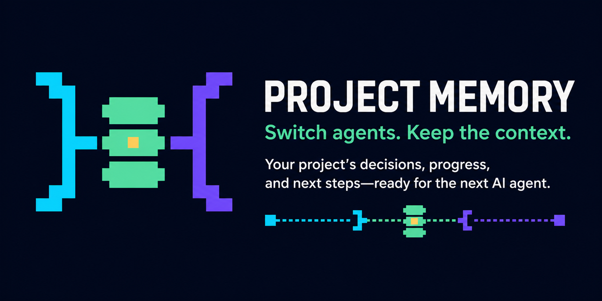

# Project Memory

**Do you switch between AI agents and have to explain your project all over
again?**

Project Memory keeps the important context inside your Git repository. When
another agent takes over, it can see what was decided, what changed, what was
completed, what was removed, and what to do next.

You keep working normally. Project Memory gives each agent the same accepted
project context and preserves the full history for later.

The Codex Plugin works offline. It has no hosted backend, login, telemetry,
cloud database, or mandatory external service.

## What it does

- Detects the project shape from the repository and the user's normal request.
- Proposes the appropriate Project Memory structure without a profile picker.
- Requires one explicit confirmation before the first bootstrap write.
- Resumes future tasks from accepted repository context instead of chat memory.
- Keeps canonical facts, decisions, work, evidence, and append-only history in
  one governed structure.
- Supports different product shapes, including applications, games, services,
  design systems, research programs, and multi-product portfolios.

## Requirements

- Codex with Plugin support
- Git
- Node.js 24

The repository includes the verified prebuilt runtime bundles. Plugin users do
not run `npm install`, and Project Memory never installs dependencies into the
product repository being documented.

## Install from GitHub

Clone the public marketplace repository:

```powershell
git clone https://github.com/pv-vimalnair/project-memory.git
cd project-memory
```

Register that clone as a local Codex marketplace and install the Plugin:

```powershell
codex plugin marketplace add "<absolute-path-to-project-memory>"
codex plugin add project-memory@project-memory
```

Start a new Codex task after installation so the Plugin's skill and local MCP
tools are loaded.

## Use

Open any Git repository in Codex and describe the work normally. The agent uses
Project Memory automatically before substantive repository work.

For a new project, the agent presents one compact bootstrap proposal and asks
for one confirmation. For an initialized project, it reads the accepted context
and continues without asking you to choose a profile or maintain generated
files manually.

Project Memory remains repository-first: the canonical record lives in Git.
Notion or another cloud tool may mirror that record, but is never required.

## Safety model

- Repository reads are diagnostic until a reviewed plan is approved.
- Canonical writes are coordinator-governed and bound to the reviewed plan and
  current Git head.
- Concurrent agents work in isolated claims and cannot silently overwrite the
  canonical record.
- History is preserved; generated views are derived from canonical sources.

See the [privacy statement](PRIVACY.md), [security policy](SECURITY.md), and
[contribution guide](CONTRIBUTING.md).

## Development

The installable Plugin and npm development package live in
`plugins/project-memory/`. Run development commands from that directory:

```powershell
npm ci --ignore-scripts
npm run check
npm run generated:verify
npm run plugin:verify
npm run package:verify
npm run publication:check
```

The architecture and permanent implementation evidence are retained under
`docs/`. Public-release authorization is recorded in
`docs/publication/PUBLICATION_APPROVALS.json`; the release gates are documented
in [`docs/publication/PUBLICATION_CHECKLIST.md`](docs/publication/PUBLICATION_CHECKLIST.md).

## License

[MIT](LICENSE) © 2026 Pv Vimal Nair
