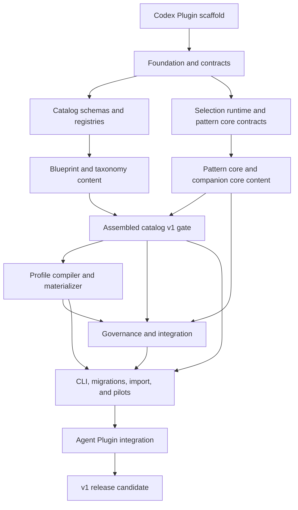

# Project Memory System Implementation Roadmap

> **For agentic workers:** REQUIRED SUB-SKILL: Use superpowers:subagent-driven-development (recommended) or superpowers:executing-plans to implement this plan task-by-task. Steps use checkbox (`- [ ]`) syntax for tracking.

**Goal:** Deliver the approved repository-first multi-agent memory system as one installable agent-first Codex Plugin containing one tested TypeScript package, one complete versioned catalog, and one safe target-repository protocol that preserves current truth, append-only history, authority, evidence, and concurrent-agent integration.

**Architecture:** A dedicated one-Plugin marketplace repository owns the reusable skill, compiler/runtime/catalog, and zero-install release bundle. `plugins/project-memory/` is the only npm package. Product repositories vendor exact catalog definitions and keep one enduring root profile plus canonical records. Workers operate in isolated branches/worktrees; one integrator validates and atomically promotes facts. Eight focused implementation plans share stable contracts and converge through explicit release gates.

**Tech Stack:** Codex Plugin and Skill manifests, Node.js 24 LTS, strict TypeScript/ESM, TypeBox/Ajv JSON Schema, YAML, esbuild, Git, Vitest, ESLint, PowerShell, GitHub Actions.

## Global Constraints

- Approved system design: repository-root `docs/superpowers/specs/2026-07-14-project-memory-system-design.md`.
- Approved agent Plugin design: repository-root `docs/superpowers/specs/2026-07-14-project-memory-agent-plugin-design.md`.
- Planning workspace: `<planning-workspace>`.
- Implementation repository: `<repository-root>`.
- Plugin package root: `plugins/project-memory/`. Unless a path is explicitly repository-root, every `src/`, `tests/`, `catalog/`, `schemas/`, `templates/`, `scripts/`, `dist/`, and npm package path in the subsystem plans is relative to this package root.
- Do not implement inside the planning workspace. The dedicated repository baseline already exists at commit `0b3c88f`; Foundation Task 1 is historical and must not be rerun. Execute the Plugin scaffold plan before Foundation Task 2.
- Use one npm package at `plugins/project-memory/` for v1. The repository root is the marketplace and documentation boundary, not a second package. Add services, databases, workspaces, or network dependencies only through a separately approved architecture change.
- Treat the approved design as normative. If a plan and the design conflict, stop and reconcile the plan before coding.
- `project.yaml` is the accepted profile-selection input; canonical records own changing facts; generated views never own truth.
- Workers may propose direction but cannot accept it. Pitaji accepts root/profile/product/architecture/security/business direction and consequential external action.
- No live product repository is part of implementation scope until its own pilot authorization exists.
- Do not push, publish, deploy, or create a pull request unless Pitaji separately asks.
- Never force-push, use `git reset --hard`, rewrite append-only history, or overwrite an existing instruction file automatically.
- Every subsystem uses test-first tasks, exact evidence, path-confined atomic writes, deterministic serialization, and injected nondeterminism.

---

## Plan Suite

Execute these plans; this roadmap coordinates them and does not replace their task-level instructions.

| Order | Plan | Primary output |
|---:|---|---|
| 0 | [Codex Plugin Scaffold](./2026-07-14-project-memory-plugin-scaffold.md) | Repo-local marketplace, Plugin manifest, implicit skill, package-root boundary |
| 1 | [Foundation and Contracts](./2026-07-14-project-memory-foundation-contracts.md) | Shared primitives, schema runtime, safe I/O/Git/process boundaries |
| 2A | [Catalog Content](./2026-07-14-project-memory-catalog-content.md) | 62 blueprints, registries, taxonomy halves, fixtures, catalog release |
| 2B | [Selection and Task Planning](./2026-07-14-project-memory-selection-planning.md) | Feature/scoring runtime, 257 pattern core halves, companion closure, flattened packets |
| 3 | [Profile Compiler](./2026-07-14-project-memory-profile-compiler.md) | Accepted selection → vendored, locked, complete target-repository profile |
| 4 | [Governance, History, and Integration](./2026-07-14-project-memory-governance-integration.md) | Records, claims, authority, views/archive, leases, single/multi-repo finalization |
| 5 | [CLI, Migrations, Import, and Pilots](./2026-07-14-project-memory-cli-migrations-pilots.md) | Internal/fallback CLI, explicit upgrades, safe legacy import, benchmarks, pilots, CI/package |
| 6 | [Agent Plugin Integration](./2026-07-14-project-memory-agent-plugin-integration.md) | Automatic startup, zero-install bundle, adapters, Plugin trials, install/publication gates |

## Dependency Graph



Catalog and selection work may proceed in parallel after foundation, but the v1 catalog lock is produced only after both halves of all 257 patterns and all 13 companion rules are present and valid.

## Exclusive File Ownership

Parallel workers must not share writable files. The integrator resolves shared entry points after subsystem commits.

| Owner plan | Exclusive paths |
|---|---|
| Plugin scaffold | Repository-root `.agents/plugins/marketplace.json`, `plugins/project-memory/.codex-plugin/**`, `plugins/project-memory/skills/project-memory/**`, repository routers, scaffold validators |
| Foundation | `src/core/**`, `src/contracts/**`, `src/schema/**` except the lead-integrator registrar list below, package/toolchain configuration, foundational tests |
| Catalog | `src/catalog/**`, pattern/companion `*.taxonomy.yaml`, blueprint/component/domain/overlay/adapter definitions, catalog fixtures |
| Selection | `src/selection/**`, `src/planning/**`, pattern/companion `*.core.yaml`, selection/planning fixtures |
| Profile compiler | `src/profile/**`, `src/materialize/**`, `templates/project-memory/**`, profile/materialization tests |
| Governance | `src/governance/**`, governance schemas/tests/fixtures |
| CLI/release | `src/cli/**`, `src/migrations/**`, `src/import/**`, `src/benchmark/**`, CLI end-to-end/release fixtures |
| Agent Plugin | `src/agent/**`, Plugin launcher/bundle/contents scripts, Plugin workflow fixtures, agent benchmarks, Plugin installation/publication runbooks, repository-root release-candidate workflow |
| Lead integrator only | Plugin-package `src/index.ts`, final Plugin-package `package.json` scripts/exports, `src/schema/project-registrars.ts`, schema index, catalog lock/bundle, release manifest, and repository-root README cross-links |

Shared generated surfaces are never edited concurrently. Subsystem workers define registrar functions and definitions in their own files; before emission, the lead integrator explicitly imports each completed registrar into `src/schema/project-registrars.ts`, runs the registrar-integration test, and only then regenerates and commits consolidated schema indexes/locks after sequential integration. Dynamic registrar discovery is forbidden.

## Stable Cross-Plan Interfaces

The names below form the v1 internal contract. A breaking rename requires a design record and updates to every dependent plan before implementation continues.

```ts
RuntimeIssue
RuntimeResult<T>
Clock
IdFactory
GitClient
CommandRunner
PlannedWrite
CanonicalMutationKind
CanonicalMutationPlan<TMetadata>
canonicalMutationPlanHash(plan)
SchemaId
SchemaRegistrar
PROJECT_SCHEMA_REGISTRARS: readonly SchemaRegistrar[]
registerProjectSchemas(registrars: readonly SchemaRegistrar[]): RuntimeResult<readonly SchemaId[]>
emitJsonSchemas(outputRoot: URL): Promise<RuntimeResult<readonly URL[]>>

CatalogSource
CatalogReleaseLock
CatalogValidationReport
CatalogReleaseArtifacts
CatalogReleaseVerification
loadCatalog(root): Promise<RuntimeResult<CatalogSource>>
assemblePatternDefinition(core, taxonomy): RuntimeResult<PatternDefinition>
assembleCompanionRule(core, taxonomy): RuntimeResult<CompanionRuleDefinition>
validateCatalog(catalog, options): RuntimeResult<CatalogValidationReport>
buildCatalogRelease(root, catalog, release): Promise<RuntimeResult<CatalogReleaseArtifacts>>
verifyCatalogRelease(root, lock): Promise<RuntimeResult<CatalogReleaseVerification>>

NormalizedFeatureMap
SelectionDecision
SelectionDisposition
ResolvedGateExecution
normalizeFeatureMap(observations): RuntimeResult<NormalizedFeatureMap>
evaluatePredicate(predicate, features): PredicateEvaluation
scoreCandidates(definitions, features, context): RuntimeResult<SelectionDecision>
selectBlueprint(definitions, features, context): RuntimeResult<SelectionDecision>
selectPattern(definitions, features, context): RuntimeResult<SelectionDecision>
loadResolvedPatterns(catalog): RuntimeResult<ResolvedPatternCatalog>
expandCompanions(input): RuntimeResult<CompanionClosure>
decomposeOutcomes(outcomes): RuntimeResult<InitiativePlan>
mergeImpacts(input): RuntimeResult<ResolvedImpactPlan>
buildTaskCoverage(patternSet, requirements, tasks): RuntimeResult<CoverageMap>
assignTaskPackets(input): RuntimeResult<readonly TaskAssignment[]>
materializeTaskPacket(input, clock, ids): RuntimeResult<TaskPacket>
validateCompletionPacket(completion, task, context): RuntimeResult<ValidatedCompletion>
validateClaimAndApprovals(task, context): RuntimeResult<AuthorityValidation>
compileWorkstream(input, clock, ids): Promise<RuntimeResult<CompileWorkstreamResult>>

ProfilePlanInput
AcceptedProfileSourceSet
SelectedCatalogLock
ProfileMutationMetadata
StagedProfileMutation
buildSelectedCatalogLock(resolvedSelection): RuntimeResult<SelectedCatalogLock>
verifySelectedCatalogLock(root, lock): Promise<RuntimeResult<SelectedCatalogLockVerification>>
ProfileCompiler.plan(input): Promise<RuntimeResult<CanonicalMutationPlan<ProfileMutationMetadata>>>
ProfileMaterializer.materializeToIsolatedStaging(input): Promise<RuntimeResult<StagedProfileMutation>>
ProfileVerifier.verify(root): Promise<RuntimeResult<ProfileVerificationReport>>

CanonicalRecordStore
ViewGenerator
ArchiveStore
ClaimService
IntegrationLeaseStore
GateRunner
StaleBaseReconciler
evaluateAuthorityCoverage(input): RuntimeResult<AuthorityCoverage>
WorkLifecycleService.planCreateInitiative(input): Promise<RuntimeResult<CanonicalMutationPlan>>
WorkLifecycleService.planCreateWorkstream(input): Promise<RuntimeResult<CanonicalMutationPlan>>
WorkLifecycleService.planCreateTaskPacket(input): Promise<RuntimeResult<CanonicalMutationPlan>>
WorkLifecycleService.planTransition(input): Promise<RuntimeResult<CanonicalMutationPlan>>
IntegrationCoordinator.bootstrap(input): Promise<RuntimeResult<BootstrapFinalization>>
IntegrationCoordinator.finalizeMutation(plan): Promise<RuntimeResult<MutationReceipt>>
IntegrationCoordinator.validate(input): Promise<RuntimeResult<ValidatedIntegration>>
IntegrationCoordinator.finalize(input): Promise<RuntimeResult<IntegrationReceipt>>
MultiRepoFinalizer.prepareSatellite(input): Promise<RuntimeResult<PreparedSatellite>>
MultiRepoFinalizer.finalizeHub(input): Promise<RuntimeResult<HubFinalizationReceipt>>

MigrationService.list(): readonly MigrationSummary[]
MigrationService.plan(input): Promise<RuntimeResult<CanonicalMutationPlan>>
LegacyImporter.scan(root): Promise<RuntimeResult<LegacyScan>>
LegacyImporter.propose(scan, context): RuntimeResult<LegacyImportProposal>
LegacyImporter.plan(input: ReviewedLegacyImportInput): RuntimeResult<CanonicalMutationPlan>

AgentStartDirective
startAgentSession(input): Promise<RuntimeResult<AgentStartDirective>>
```

All fallible public domain methods plus exported parsing, validation, path-safety, schema-emission, command-wrapper, and write helpers return `RuntimeResult` (or `Promise<RuntimeResult<...>>`); pure total helpers such as `evaluatePredicate` and read-only registry enumeration may return their direct immutable value. Only the narrowly contained injected ports `CommandRunner`, `GitClient`, and `TransactionFileSystem` may reject or throw, and callers convert those failures before returning across a public domain boundary; startup-only `registerSchema` may throw only for programmer/configuration defects before untrusted input is processed. Exactly two entrypoints may explicitly map issues to process exit codes: distributable `src/cli.ts` and internal build-only `src/catalog/commands/build-tool.ts`. `src/schema/emit.ts` may throw one formatted top-level error after a failed result so Node exits naturally, but it never calls `process.exit` or assigns `process.exitCode`. `CatalogReleaseLock` covers the complete immutable master release emitted by `buildCatalogRelease`; `SelectedCatalogLock` covers only the exact vendored closure in one target repository and is emitted by `buildSelectedCatalogLock`. The types and their build/verify methods are not aliases. Foundation alone owns `CanonicalMutationPlan`, `CanonicalMutationKind`, and `canonicalMutationPlanHash`; profile, governance, migration, and import plans may provide typed metadata but must import the shared contract from `src/index.ts`.

## Schema and ID Contract

- Catalog definition IDs: lowercase dot-separated identifiers matching `^[a-z][a-z0-9-]*(\.[a-z][a-z0-9-]*)+$`.
- Project instances: `ROOT-`, `CMP-`, `DOM-`, `INIT-`, `WS-`, `TASK-`, `CLAIM-`, `PKT-`, `DEC-`, `IDEA-`, `CHG-`, `FIND-`, `RISK-`, `EVD-`, `LESSON-`, and `APR-` plus a ULID.
- Schema IDs: `project-memory/v1/<artifact-name>`.
- Source catalog root: `catalog/project-memory/v1/`.
- Generated schema root: `schemas/project-memory/v1/`.
- Pattern halves: `catalog/project-memory/v1/patterns/<family>/<pattern-id>.core.yaml` and `<pattern-id>.taxonomy.yaml`.
- Companion halves: `catalog/project-memory/v1/companion-rules/<rule-id>.core.yaml` and `<rule-id>.taxonomy.yaml`.
- A core/taxonomy pair must share exact ID and version. Missing, duplicate, or mismatched halves fail closed.
- Canonical hashes use UTF-8 canonical JSON, lexicographically sorted object keys, preserved array order, and one trailing LF.
- Every `ResolvedGateExecution` retains the approved spec-facing `type` and `command_or_check` fields and also carries a structured `execution` union. `command_or_check` is a deterministic human/audit representation and is never parsed or executed; only `execution` may reach the shell-free gate runner.
- `selectBlueprint` and `selectPattern` are typed narrowing wrappers around the only scoring engine, `scoreCandidates`; neither wrapper may reproduce scoring, confidence, precedence, or tie logic.
- The one schema command is `npm run schemas:emit`. It invokes the explicit `PROJECT_SCHEMA_REGISTRARS` aggregation before emission; each subsystem registrar must be wired and integration-tested by the lead integrator before its schemas can appear. The foundation package defines `catalog:validate`, `catalog:inventory`, `catalog:fixtures`, `catalog:lock`, and `catalog:bundle` before catalog work invokes them.
- `ProfileCompiler.plan` returns the shared immutable `CanonicalMutationPlan<ProfileMutationMetadata>`; every governance lifecycle producer, `MigrationService.plan`, and `LegacyImporter.plan` returns the default shared `CanonicalMutationPlan`. Their materializers are staging-only and no domain service exposes an `apply` method that can advance a canonical ref.
- `IntegrationCoordinator.bootstrap` may validate bootstrap-only preconditions and build or augment a `profile.bootstrap` mutation plan with approval, evidence, event, and generated-view writes, but it must delegate exactly once to `IntegrationCoordinator.finalizeMutation`. Bootstrap has no worktree, commit-creation, or ref-update implementation of its own; the same lease, revalidation, isolated staging, commit, cleanup, and compare-and-swap engine serves every canonical mutation.

## Integration Checkpoints

### Checkpoint A: Plugin Scaffold and Foundation Ready

- [ ] Validate the repository-local marketplace, Plugin manifest, implicit skill, and package-root boundary with the official Plugin and skill validators.
- [ ] Confirm Foundation Task 1 remains historical, then complete Foundation Tasks 2-10 in order from `plugins/project-memory/`.
- [ ] Review direct package metadata and obtain Pitaji's approval for the exact new dependency set before installation.
- [ ] Run `npm run check` and the foundation deterministic/fault-injection gates.
- [ ] Record the clean foundation commit and tag in the implementation work log.

Exit condition: downstream plans can import stable results, schemas, hashing, transactions, Git, and command abstractions.

### Checkpoint B: Catalog and Selection Contracts Ready

- [ ] Integrate catalog schemas/loader/validator without full content; wire `registerCatalogSchemas` into `PROJECT_SCHEMA_REGISTRARS` and pass the registrar-integration test before the first catalog schema emission.
- [ ] Integrate normalized features, predicates, scoring, and selection using minimal fixtures.
- [ ] Run cross-contract tests for YAML keys, TypeScript types, schema IDs, root kinds, archetypes, modes, and selection dispositions.
- [ ] Freeze the v1 contract surface before parallel catalog population.

Expected contract inventory:

```text
root_kinds=5
primary_archetypes=11
pattern_modes=9
pattern_families=16
selection_dispositions=3
errors=0
```

### Checkpoint C: Complete v1 Catalog Assembled

- [ ] Populate 11 blueprint groups and exactly 62 blueprints.
- [ ] Populate component, 15-domain, overlay, and 15-adapter registries.
- [ ] Populate exactly 257 pattern core halves and 257 taxonomy halves.
- [ ] Populate exactly 13 companion core halves and 13 taxonomy halves.
- [ ] Run 62 positive, 62 anti-signal, and 26 boundary blueprint cases.
- [ ] Run compatible/incompatible fixtures for every pattern and companion rule.
- [ ] Assemble definitions, generate the catalog lock/bundle, and verify deterministic hashes twice.

Required output:

```text
blueprint_groups=11
blueprints=62
blueprint_fixture_cases=150
pattern_families=16
pattern_cores=257
pattern_taxonomy_bindings=257
assembled_patterns=257
companion_cores=13
companion_taxonomy_bindings=13
assembled_companion_rules=13
missing_halves=0
errors=0
```

### Checkpoint D: Profile Compiler Ready

- [ ] Compile small-service, LifeOf-style, and Dino Escape-style golden repositories.
- [ ] Verify accepted input, vendored definitions, catalog lock, and profile lock independently.
- [ ] Prove same inputs generate same bytes and stale/tampered inputs leave state unchanged.
- [ ] Verify optional agent adapters never duplicate canonical truth.

Exit condition: a target repository receives one fixed startup doorway and the complete safe v1 structure without profile invention.

### Checkpoint E: Governed Work Lifecycle Ready

- [ ] Compile compound briefs into bounded workstreams and task packets.
- [ ] Verify companion fixed-point closure, resolved component/domain duties, and task coverage.
- [ ] Prove immutable record creation/supersession and generated-view freshness.
- [ ] Prove archive addressing/redaction/immutability.
- [ ] Run claim collision/expiry/renewal tests and 16-process lease contention.
- [ ] Run stale-base semantic-conflict tests and shell-free current-base gates.
- [ ] Run atomic single-repository finalization with fault injection.
- [ ] Run two-phase satellite/hub prepare/finalize/recovery tests.

Exit condition: a worker result cannot become canonical without current authority, claim, evidence, gates, approval, and the active integration lease.

### Checkpoint F: CLI, Agent Plugin, Import, and Release Candidate Ready

- [ ] Wire `init plan/apply` through the one-time bootstrap coordinator, then wire all normal subsystem commands through stable result/exit contracts.
- [ ] Expose read-only `agent start`, bind the implicit skill to it, and prove deterministic bootstrap/resume/blocked directives.
- [ ] Produce and verify a deterministic, self-contained Plugin bundle that starts without `node_modules`, package installation, network access, or a global CLI.
- [ ] Prove migration plan/apply idempotence and historical preservation.
- [ ] Prove legacy import keeps originals and proposed/accepted boundaries.
- [ ] Run scratch LifeOf, Dino Escape, and external-only campaign pilots.
- [ ] Run the 150-brief benchmark and recorded lower-reasoning trials.
- [ ] Run Windows/Linux CI and reproducible package checks.
- [ ] Prepare live-pilot handoffs without modifying live repositories.

Exit condition: the CLI release-candidate gate and every Final Plugin Gate item that does not require separately approved installation or publication are green.

## Parallel Execution Rules

- A worker receives one bounded task and exclusive writable paths.
- All workers start from the recorded integration head in isolated branches/worktrees.
- Pattern-family workers may run in parallel because each owns one family directory.
- Blueprint-group workers may run in parallel because each owns one group directory.
- Registry workers may run in parallel only after their schemas and ID lists are frozen.
- No worker writes the catalog release lock, schema index, top-level package exports, or release manifest.
- A worker submits a completion packet with exact commands/results; passing on its branch is not final integration evidence.
- The integrator replays each packet sequentially on the latest head and reruns conflict-sensitive gates.
- A semantic conflict returns to the worker even when Git can merge the text.

## Authority Checkpoints During Implementation

Stop and request Pitaji's decision before:

- [ ] Installing the initial exact third-party dependency set or adding any later dependency.
- [ ] Changing an approved root/archetype/blueprint/overlay boundary.
- [ ] Changing worker, integrator, or Pitaji authority semantics.
- [ ] Weakening evidence, claim, stale-base, lease, archive, or atomicity requirements.
- [ ] Introducing a breaking schema/catalog version.
- [ ] Modifying a live LifeOf, Dino Escape, or other product repository.
- [ ] Registering or installing the Plugin in the user Codex environment.
- [ ] Choosing a public license, GitHub destination, package identity, or release channel.
- [ ] Publishing a package, deploying, creating external communications, or executing any other external action.

Routine implementation inside approved interfaces can proceed without repeated directional approval.

## Specification Coverage Matrix

| Approved design area | Owning plan and gate |
|---|---|
| Enduring root, 62 profiles, components/domains/overlays/adapters | Catalog Checkpoint C |
| Profile materialization, locks, fixed startup doorway | Profile Checkpoint D |
| 257 work patterns, 13 companions, automatic selection | Catalog + Selection Checkpoints B/C |
| Decomposition, impact merge, flattened task/completion packets | Selection + Governance Checkpoint E |
| Canonical records and one-fact-one-home | Governance Checkpoint E |
| Append-only history, generated views, archive | Governance Checkpoint E |
| Claims, authority, approvals, stale bases, lease | Governance Checkpoint E |
| Atomic single-repo and two-phase multi-repo finalization | Governance Checkpoint E |
| Exact migrations and no silent upgrades | CLI Checkpoint F |
| Legacy PRD/decision/worklog/handoff import | CLI Checkpoint F |
| 150 briefs, 98% target, lower-reasoning evidence | CLI Checkpoint F |
| LifeOf and Dino Escape pilots | CLI Checkpoint F |
| Automatic Plugin invocation, zero-install runtime, and cross-tool fallback | Agent Plugin Checkpoint F |

## Final Definition of Done

The system is complete only when all statements below have current evidence:

- [ ] An incoming agent reaches accepted context through one fixed doorway.
- [ ] An installed Plugin invokes that doorway automatically from natural project work; no user or agent browses profile folders or invents a structure.
- [ ] Completed, active, proposed, rejected, removed, superseded, and next work are discoverable.
- [ ] One product remains one root while campaigns, audits, redesigns, refactors, security checks, and releases remain workstreams.
- [ ] All 62 blueprint and 257 pattern definitions are materialized, versioned, assembled, and contract-tested.
- [ ] Supported briefs resolve at least `98%` without schema invention and with at most one clarification.
- [ ] Lower-reasoning agents operate from flattened packets and do not invent duties or authority.
- [ ] Every fact has one canonical home; generated views are reproducible and disposable.
- [ ] Workers cannot overwrite canonical truth or accept directional state.
- [ ] Every verified task has exact evidence from the current integration base.
- [ ] Catalog/profile upgrades are explicit, locked, diffed, and migrated.
- [ ] Historical decisions, ideas, findings, changes, packets, and superseded selections remain verifiable.
- [ ] Failed validation/finalization leaves prior canonical state unchanged.
- [ ] Scratch pilots and cross-platform release gates pass.
- [ ] Live pilots and publication remain unexecuted until separately authorized.

